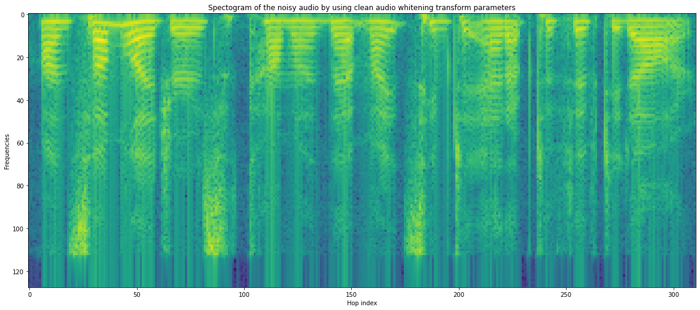
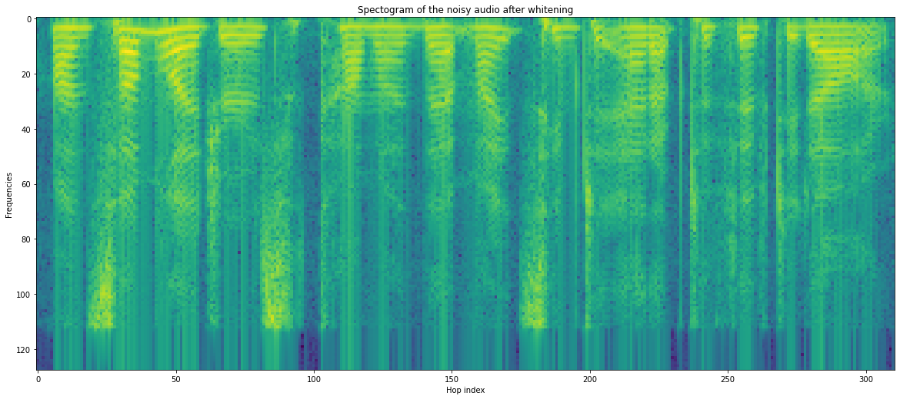
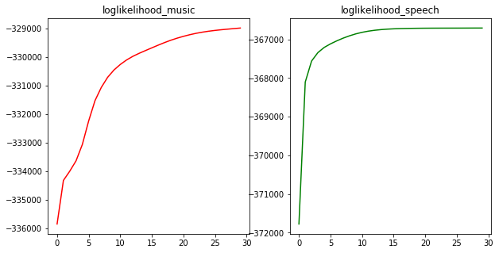

<h2>Speech Spectrogram </h2>

In this project, whitening transform on speech spectrogram of audio files are studied to analyse the speech data. A speech spectrogram shows the Fourier Transform of a signal as it varies with time. A whitening transformation or sphering transformation is a linear transformation that transforms a vector of random variables with a known covariance matrix into a set of new variables whose covariance is the identity matrix, meaning that they are uncorrelated and each have variance .

  
	

	
<figure>
	
    <figcaption>The covariance matrix of spectrogram of data before whitening </figcaption>
</figure>

<figure>
	
    <figcaption>The covariance matrix of spectrogram of data after whitening</figcaption>
</figure>

The above two plots represent the covariance matrices of the noisy audio and its whitening transformation. We can see the differences between the above two covariance matrix plottings. After whitening, the covariance matrix of noisy audio is the identity matrix, and all the non-diagonal entries are almost zero.

The average absolute value of the non-diagonal entry for noisy audio is: 9.285590908753007e-17

	
<figure>

<figcaption>The spectogram of the noisy audio before whitening.</figcaption>
</figure>

<figure>

<figcaption>The spectogram of the noisy audio after whitening.</figcaption>
</figure>

	

	
	
log_likelihood_speech_vs_music.png	
	

<figure>

<figcaption>log likelihood graph for speech and music</figcaption>
</figure>

	
<h2> GMM Results of audio classification:	</h2>

test_accuracy 70.83333333333334

2-GMM with FULL-Covariance matrix test_accuracy 87.5

2-GMM with Diagonal-Covariance matrix test_accuracy 68.75

5-GMM with FULL-Covariance matrix test_accuracy 89.58333333333334

5-GMM with Diagonal-Covariance matrix test_accuracy 70.83333333333334

We observed the following thing from the above experiment.

The accuaracy of the 5-GMM is more than 2-GMM model.

The accuracy of the 2-GMM with full-covariance matrix is more than 2-GMM with Diagonal covariance matrix.

The accuracy of the 5-GMM with full-covariance matrix is more than 5-GMM with Diagonal covariance matrix.

Because, GMM-model with more guassians can model data in a better manner.

GMM-with full-covariance matrix is more powerful than Daiagonal covariance matrix.

In the diagonal covariance matrix, we are modeling features as independent.

In the full-covariance matrix, we are considering correlation between individual features.

That's why, GMM-model with full-covariance matrix is more powerful than GMM-with diagonal covariance matrix.

	
	
	
	
	
