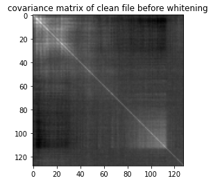
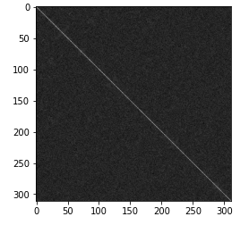

<h2>The spectra of tridiagonal k-Toeplitz matrices</h2>

In this project,whitening transform on speech spectrogram of audio files are studied to analyse the speech data.A speech spectrogram shows the Fourier Transform of a signal as it varies with time. A whitening transformation or sphering transformation is a linear transformation that transforms a vector of random variables with a known covariance matrix into a set of new variables whose covariance is the identity matrix, meaning that they are uncorrelated and each have variance 1.The covariance matrix of spectrogram of data before whitening

  

	
<figure>
	
    <figcaption>The covariance matrix of spectrogram of data before whitening </figcaption>
</figure>

<figure>
	
    <figcaption>The covariance matrix of spectrogram of data after whitening
 </figcaption>
</figure>

